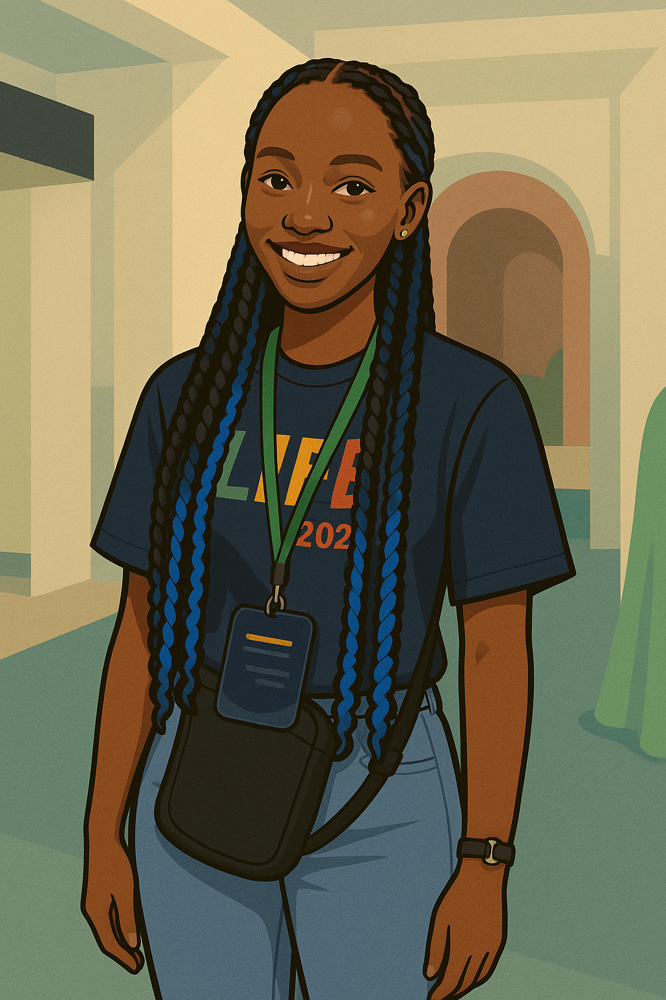

# Hi there, I'm Shakiran 👋

---

    

   
# 💻 About Me

<table>
    <tr>
        <td align="center" width="220" valign="top">
            
        </td>
        <td valign="top" align="center">
            

                I'm currently focused on building innovative web applications and exploring the intersection of artificial intelligence, machine learning, and data science.  
                My projects involve developing robust APIs, enhancing user experiences with modern frontend frameworks, and contributing to open-source initiatives.  
                I'm passionate about leveraging technology to solve real-world problems and continuously expanding my skill set in the ever-evolving tech landscape.
            

        </td>
    </tr>
</table>

- 🌱 I’m currently learning **Javascript, Web development, AI/ML, Data Science, and Flutter**

---

### ✨ More About Me

- 📫 **How to reach me:**  
      
    *Let's connect and collaborate!*

- 😄 **Pronouns:**  
      
    *Empowering diversity in tech!*

---
- ⚡ Fun fact: *I love blending design with technology!*

---

### 🛠️ Tech Stack

---

### 📊 GitHub Stats

---

### 🌐 Let's Connect

 <!-- Add your actual link -->

<!-- Feel free to add or remove sections as you like! -->
