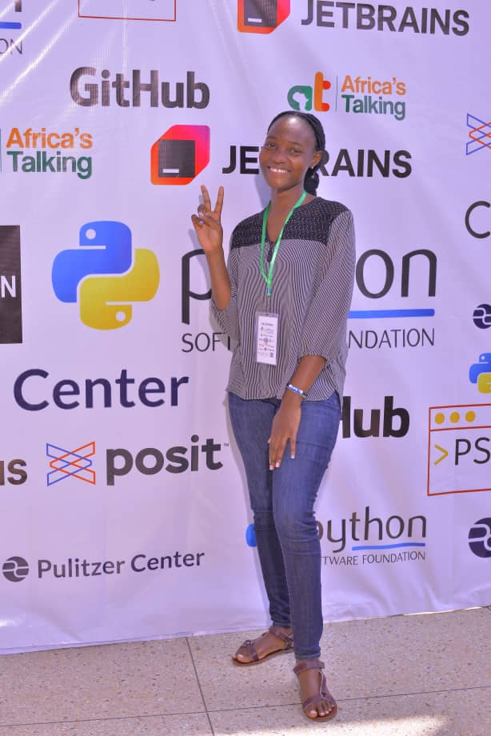

# Hi there, I'm Shakiran 👋

</a> *Let's connect and collaborate!* |  *Empowering diversity in tech!* |   *Feel free to reach out for collaboration or questions!* |  *Thanks for stopping by!* |iran.png" alt="Skills Animation" width="1280"/>

---

    

   
# 💻 About Me

**Welcome to my digital space!** 🚀

I'm passionate about **creating impactful solutions** that blend **creativity** and **technology**. My curiosity drives me to explore **artificial intelligence**, **machine learning**, **data science**, **cyber security**, **mobile development**, **web development**, and **design**.

I love contributing to **open-source projects** and believe in the power of collaboration to solve real-world challenges. Every day is an opportunity to learn, grow, and make a difference through code!

🌟 **Interesting Fact:** I'm a good dancer 😄 (Jokes aside, I really love dancing and music.)

 
<em>Check out my projects and experience!</em>

 
 

<table align="center">
    <tr>
        <th>📫 How to reach me</th>
        <th>Pronouns</th>
        <th>📧 Email</th>
        <th>👀 Profile Views</th>
    </tr>
    <tr>
        <td>
            
             
            Let's connect and collaborate!
        </td>
        <td>
            
             
            Empowering diversity in tech!
        </td>
        <td>
            
             
            
             
            Feel free to reach out for collaboration or questions!
        </td>
        <td>
            
             
            Thanks for stopping by!
        </td>
    </tr>
</table>

---

### 🛠️ Tech Stack

#### 🚀 Tools & Platforms

    <!-- Design Tools -->
    
    
    
    <!-- Development Tools -->
    
    
    
    
    
    <!-- Collaboration & Productivity -->
    
    

    
💡 Other ideas to include here

    
- Frameworks (e.g., React, Django, Flutter, Node.js)
- Databases (e.g., MySQL)
- Cloud platforms (e.g., AWS, Azure, Google Cloud)
- CI/CD tools (e.g., GitHub Actions, Jenkins)
- Testing tools (e.g., Jest, Selenium)
- Operating systems (e.g., Linux, Windows)
- APIs and integrations
- Any other tools you use regularly!

---

### 📊 GitHub Stats

 <!-- Weekly Development Breakdown
 -->

---

### 📈 Contribution Activity

 <!-- 🤝 Open Source Contributions
- 🔥 [Project Name] - [Your contribution]
- ⭐ [Another Project] - [Your role/contribution]
- 📦 Created [Number] packages with [total downloads] -->

---

