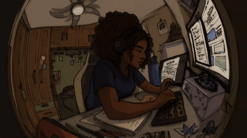

# Hi there, I'm Shakiran 👋

  

---

    

# 💻 About Me

**Welcome to my digital space!** 🚀

I'm **a problem solver** who loves **creating impactful solutions** that combine **creativity** and **technology**. I am passionate about **Design** and **data**.
I take every day as an opportunity to learn, grow, and make a difference through code!

🌟 **Interesting Fact:** I'm a good dancer 😄 (Jokes aside, I really love dancing and music.)

 
<em>Check out my projects and experience!</em>

  

 
 

#### 🚀 Tools & Platforms

    <!-- Design Tools -->
    
    
    
    <!-- Development Tools -->
    
    
    
    
    
    <!-- Collaboration & Productivity -->
    
    

  

  <h3>🛠️ Tech Stack & 📊 GitHub Stats</h3>
  
  

